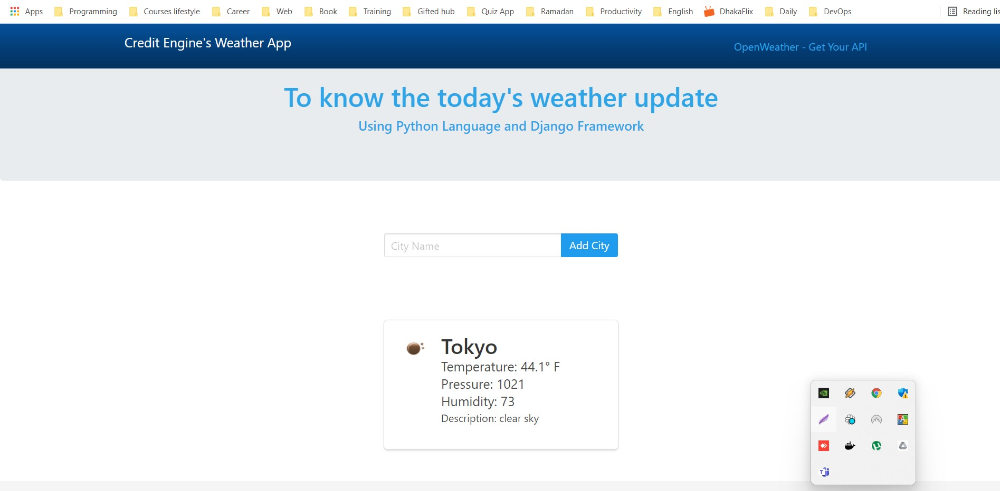

#### Features Implemented:
  [x] Search the city
  [x] Calling the open api from <https://openweathermap.org/api>
  [x] Dockerize the project
  [x] add css for a source
  [x] add global css
  [x] modify admin html (dashboard)
  [x] custom form distribution
  [] Deploy to aws 
      [x] Build image on AWS ECR
      [x] Deploy on ECS
      [] Faceing some issues to deploy,it's fixable but it may take more hours 

### Client View
Here is the client view of this project:


# Quick start with Docker Django & Run locally
=============
# Set up the environment
Install Docker Engine from the tutorial https://docs.docker.com/engine/installation/.
Install Docker Compose from the tutorial https://docs.docker.com/compose/install/.

Get the latest project clone to your computer:
$ git clone https://github.com/tanvirewu/Credit-engine-weather-app-by-using-open-wather-api.git

Run docker-compose commands to start containers:
$ docker-compose up


Now you can access the application at <http://0.0.0.0:8000/> and the admin site
at <http://0.0.0.0:8000/admin>.

1. pip install -r requirements.txt
2. python manage.py makemigrations credit_e_weather
3. python manage.py migrate credit_e_weather
4. python manage.py runserver
### Run without docker


## Folder structure

```
tanvir@tanvir-Inspiron-3501:~/Desktop/credit/credit_engine_weather$ tree -L 1 --dirsfirst
├── credit_engine_weather
├── credit_e_weather
├── data
├── db.sqlite3
├── docker-compose.yml
├── Dockerfile
├── manage.py
├── Pipfile
├── Pipfile.lock
└── requirements.txt
```

## Troubleshooting
Q: I get the following error message when using the docker command:

```
FATA[0000] Get http:///var/run/docker.sock/v1.16/containers/json: dial unix /var/run/docker.sock: permission denied. Are you trying to connect to a TLS-enabled daemon without TLS? 

```
# Full tree directory of "credit_engine_weather" project

tanvir@tanvir-Inspiron-3501:~/Desktop/credit/credit_engine_weather$ tree
.
├── credit_engine_weather
│   ├── asgi.py
│   ├── __pycache__
│   │   ├── settings.cpython-310.pyc
│   │   ├── urls.cpython-310.pyc
│   │   └── wsgi.cpython-310.pyc
│   ├── settings.py
│   ├── urls.py
│   └── wsgi.py
├── credit_e_weather
│   ├── admin.py
│   ├── apps.py
│   ├── forms.py
│   ├── __init__.py
│   ├── migrations
│   │   ├── 0001_initial.py
│   │   ├── __init__.py
│   │   └── __pycache__
│   │       ├── 0001_initial.cpython-310.pyc
│   │       └── __init__.cpython-310.pyc
│   ├── models.py
│   ├── __pycache__
│   │   ├── admin.cpython-310.pyc
│   │   ├── apps.cpython-310.pyc
│   │   ├── forms.cpython-310.pyc
│   │   ├── __init__.cpython-310.pyc
│   │   ├── models.cpython-310.pyc
│   │   ├── urls.cpython-310.pyc
│   │   └── views.cpython-310.pyc
│   ├── templates
│   │   └── weather
│   │       └── weather.html
│   ├── tests.py
│   ├── urls.py
│   └── views.py
├── data
│   └── db [error opening dir]
├── db.sqlite3
├── docker-compose.yml
├── Dockerfile
├── manage.py
├── Pipfile
├── Pipfile.lock
├── README.md
└── requirements.txt

10 directories, 35 files
